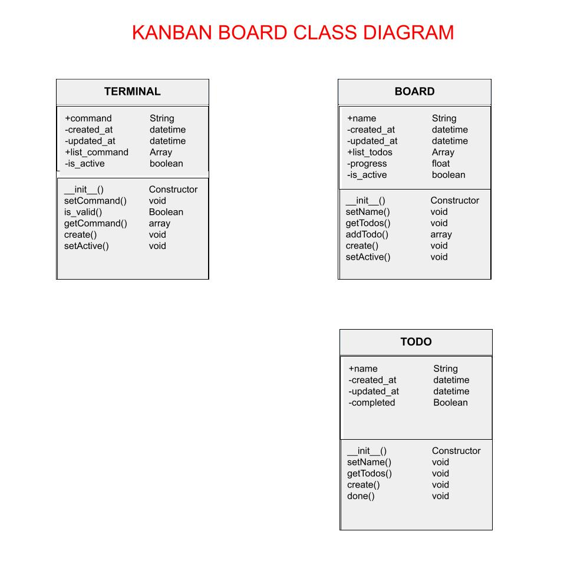

<!-- Please update value in the {}  -->

<h1 align="center">Kanban Board Terminal</h1>

<p>Metodo visual de gesión de proyectos que permite visualizar sus flujos y carga de trabajo.</p>

<!-- 
<div align="center">
   Solution for a challenge from  <a href="https://learn.microsoft.com/en-us/training/modules/plan-moon-mission-using-python-pandas/1-introduction" target="_blank">Microsoft</a>.
</div> -->


<!--  -->



<!-- 
<div align="center">
  <h3>
    <a href="https://{your-demo-link.your-domain}">
      Demo
    </a>
    <span> | </span>
    <a href="https://{your-url-to-the-solution}">
      Solution
    </a>
    <span> | </span>
    <a href="https://devchallenges.io/challenges/O2iGT9yBd6xZBrOcVirx">
      Challenge
    </a>
  </h3>
</div>

<!-- TABLE OF CONTENTS -->
<!-- 
## Table of Contents

- [Manejo y representacion de Datos](#overview)
  - [over the moon](#built-with)
- [Aprendizaje Automatico](#features)
  - [prediccion de meteoros](#built-with)
- [How to use](#how-to-use)
- [Contact](#contact)
- [Acknowledgements](#acknowledgements) -->

<!-- OVERVIEW -->

## Objetivos de aprendizaje(over the moon)

En este módulo, comenzará a desarrollar las habilidades para:

- Cree una representación clara de datos de muchas fuentes.
- Use Python y pandas para explorar datos.
- Utilice técnicas de limpieza de datos para obtener una representación clara de los datos.
- Haz una hipótesis sobre cuánta roca pueden traer los astronautas en las misiones de Artemisa. :)

### Objetivos de aprendizaje(Prediccion de Meteoritos)

Obtenga información sobre cómo usar conceptos de aprendizaje automático para predecir la aparición de lluvias de meteoros (o las lágrimas de la diosa Luna).
Objetivos de aprendizaje

En este módulo, aprenderá lo siguiente:

  Los aspectos básicos de las lluvias de meteoros: qué son y por qué se ven.
  Cómo elegir y recopilar los datos adecuados.
  Estrategias para limpiar y manipular los datos.


## Features

<!-- List the features of your application or follow the template. Don't share the figma file here :) -->

This application/site was created as a submission to a [DevChallenges](https://devchallenges.io/challenges) challenge. The [challenge](https://devchallenges.io/challenges/O2iGT9yBd6xZBrOcVirx) was to build an application to complete the given user stories.

## How To Use

<!-- Example: -->

To clone and run this application, you'll need [Git](https://git-scm.com) and [Node.js](https://nodejs.org/en/download/) (which comes with [npm](http://npmjs.com)) installed on your computer. From your command line:

```bash
# Clone this repository
$ git clone https://github.com/your-user-name/your-project-name

# Install dependencies
$ npm install

# Run the app
$ npm start
```

## Acknowledgements

<!-- This section should list any articles or add-ons/plugins that helps you to complete the project. This is optional but it will help you in the future. For example -->

- [Steps to replicate a design with only HTML and CSS](https://devchallenges-blogs.web.app/how-to-replicate-design/)
- [Node.js](https://nodejs.org/)
- [Marked - a markdown parser](https://github.com/chjj/marked)

## Contact

- Website [your-website.com](https://{your-web-site-link})
- GitHub [@your-username](https://{github.com/your-usermame})